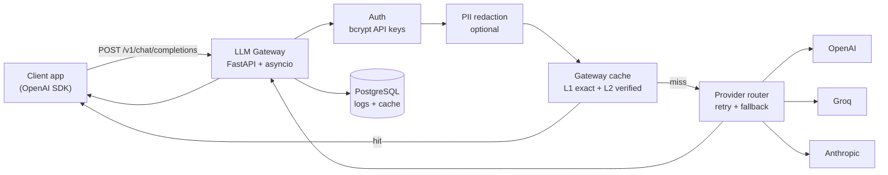

# LLM Gateway

**OpenAI-compatible Chat Completions gateway** for production LLM apps — one API in front of OpenAI, Groq, and Anthropic, with streaming, semantic cache, retries, observability, and optional PII redaction.

> Drop-in proxy: clients change only `base_url` and `api_key`; gateway policy handles auth, routing, streaming, caching, retries, metrics, and privacy controls.

[](https://www.python.org/downloads/)
[](https://fastapi.tiangolo.com/)
[](#run-tests)

---

## Why this exists

Calling an LLM API directly works until you need **auth**, **streaming that cancels on disconnect**, **cache hits on similar prompts**, **p95 latency you can explain with measured benchmarks**, and **optional tokenization of email/phone (and opt-in card/IBAN) before the provider**.

This project is a **production-style gateway** — not a chat UI — built in phased commits with measured trade-offs documented in [`docs/DESIGN.md`](docs/DESIGN.md).

---

## At a glance

| | |
|---|---|
| **Thin-proxy overhead** | **~+41 ms p50** vs direct OpenAI (cache bypass) — [`docs/BENCHMARK.md`](docs/BENCHMARK.md) |
| **Semantic cache** | L1 exact fingerprint + L2 verified semantic (candidate @ 0.65, gpt-4o-mini verifier) |
| **Providers** | OpenAI · Groq · Anthropic with retries + cross-provider fallback |
| **PII (optional)** | Email & phone (Latin + RTL); opt-in credit card (Luhn) & IBAN (MOD-97); **non-streaming only** |
| **Test coverage** | Automated unit + HTTP + PostgreSQL integration tests |

---

## Screenshots and demo report

Portfolio visuals are generated locally — PNG files are not checked in by default.

1. **PII + streaming + cache sample report** — run `python scripts/generate_screenshot_report.py`, then open [`docs/portfolio/report.html`](docs/portfolio/report.html) and screenshot sections as needed.
2. **Dashboard** — with the server running, open http://127.0.0.1:8001/dashboard (mask/blur your API key before sharing).

Optional: save PNGs under [`docs/portfolio/screenshots/`](docs/portfolio/screenshots/) and embed them in your fork’s README.

---

## How it works



**Streaming path:** SSE chunks forwarded immediately; upstream cancelled when the client disconnects — no full-response buffering.

**Cache path:** Non-streaming requests check L1 exact fingerprint first; on miss, L2 retrieves embedding candidates (≥ 0.65) and verifies answer equivalence before reuse. See [`docs/CACHE_TUNING.md`](docs/CACHE_TUNING.md).

---

## What you get

### Core proxy
- OpenAI-compatible `POST /v1/chat/completions` (JSON + SSE)
- Model-based routing: GPT → OpenAI, Llama/Mixtral → Groq, Claude → Anthropic
- Transient error retries and optional fallback model swap

### Production concerns
- **Observability** — PostgreSQL-backed `/v1/metrics` + dashboard; Prometheus `/metrics` with Grafana stack (v0.2.0+)
- **Security** — bcrypt-hashed API keys with indexed lookup prefix ([`docs/SECURITY.md`](docs/SECURITY.md))
- **PII** — optional regex redaction for email/phone (non-streaming); opt-in credit card & IBAN; streaming PII redaction remains out of scope ([`docs/PII.md`](docs/PII.md))

### Evidence, not hand-waving
- Final controlled latency validation (30 iterations per path) in `docs/benchmark_validation_4path.json`
- Historical before/after optimization runs in `docs/benchmark_*.json`
- Design doc with rejected alternatives and honest limitations
- Integration tests for auth, streaming concurrency, cache hits, provider resilience

---

## Quick start

**Prerequisites:** Python 3.11+, Docker (PostgreSQL), OpenAI API key

```powershell
git clone https://github.com/AseelHerzallah1/llm-gateway.git
cd llm-gateway

python -m venv .venv
.venv\Scripts\Activate.ps1          # Windows
# source .venv/bin/activate         # macOS/Linux

pip install -r requirements.txt
pip install -e ".[dev]"

copy .env.example .env              # set OPENAI_API_KEY, DATABASE_URL

docker compose up db -d
alembic upgrade head
python scripts/seed_test_project.py # save the gw-sk-... key

uvicorn app.main:app --host 127.0.0.1 --port 8001
```

**Full local stack** (PostgreSQL + gateway + Prometheus + Grafana):

```powershell
docker compose up
```

Open Grafana at http://localhost:3000 (default `admin` / `admin`, overridable via `.env`) — the **LLM Gateway Overview** dashboard is provisioned automatically. See [`docs/OBSERVABILITY.md`](docs/OBSERVABILITY.md).

**Minimal Docker dev** (database + app only):

```powershell
docker compose up db app
```

### Try it in one minute

**Terminal 1** — keep the server running:

```powershell
uvicorn app.main:app --host 127.0.0.1 --port 8001
```

**Terminal 2** — five-step live demo (health → chat → stream → cache → metrics):

```powershell
python scripts/demo.py gw-sk-your-key
```

Optional PII demo (set `PII_REDACTION_ENABLED=true` in `.env`; add `PII_REDACT_CREDIT_CARD=true` / `PII_REDACT_IBAN=true` for opt-in types; restart server):

```powershell
python scripts/test_pii_redaction.py gw-sk-your-key
```

Full manual matrix: [`docs/TESTING.md`](docs/TESTING.md)

### Run tests

```powershell
pytest                  # full suite (requires PostgreSQL for db-marked tests)
pytest -m db -v         # PostgreSQL integration only
```

CI runs the full suite on every PR and push to `main`. Release builds publish Docker images to `ghcr.io/aseelherzallah1/llm-gateway` when you push a `v*.*.*` tag.

---

## Documentation

| Doc | Read this for… |
|-----|----------------|
| [`docs/DESIGN.md`](docs/DESIGN.md) | **Why** — streaming, cache, fallback trade-offs |
| [`docs/ARCHITECTURE.md`](docs/ARCHITECTURE.md) | Component map and data flow |
| [`docs/API.md`](docs/API.md) | Endpoints, schemas, error codes |
| [`docs/BENCHMARK.md`](docs/BENCHMARK.md) | Measured gateway latency overhead |
| [`docs/CACHE_TUNING.md`](docs/CACHE_TUNING.md) | Similarity threshold experiments |
| [`docs/SECURITY.md`](docs/SECURITY.md) | API key hashing audit |
| [`docs/PII.md`](docs/PII.md) | Supported PII types, config, limitations |
| [`docs/TESTING.md`](docs/TESTING.md) | Manual + automated test guide |
| [`docs/OBSERVABILITY.md`](docs/OBSERVABILITY.md) | `/v1/metrics` vs `/metrics`, Prometheus + Grafana |

---

## Project layout

```
app/
  auth/           API keys (bcrypt)
  cache/          Semantic cache + PostgreSQL persistence
  providers/      OpenAI, Groq, Anthropic — router, retry, fallback
  observability/  Request logs, percentiles, cost, Prometheus metrics
  security/       PII detection and redaction
  routes/         chat, metrics, prometheus, dashboard, health
deploy/           Prometheus + Grafana provisioning
tests/            unit + integration (pytest -m db)
scripts/          demo.py, benchmarks, E2E helpers
docs/             design decisions and measured results
```

---

## Local endpoints

| URL | Description |
|-----|-------------|
| http://127.0.0.1:8001/health | Liveness |
| http://127.0.0.1:8001/v1/chat/completions | Chat proxy |
| http://127.0.0.1:8001/v1/metrics | Latency percentiles + cost (PostgreSQL, authenticated) |
| http://127.0.0.1:8001/metrics | Prometheus operational telemetry (internal; unauthenticated) |
| http://127.0.0.1:8001/dashboard | Minimal metrics UI |
| http://localhost:3000 | Grafana — **LLM Gateway Overview** (with `docker compose up`) |
| http://localhost:9090 | Prometheus UI (with full stack) |

---

## Stack

Python 3.11 · FastAPI · httpx · asyncio · PostgreSQL · SQLAlchemy async · Alembic · pytest

---

Built by [AseelHerzallah1](https://github.com/AseelHerzallah1) — feedback and issues welcome.
