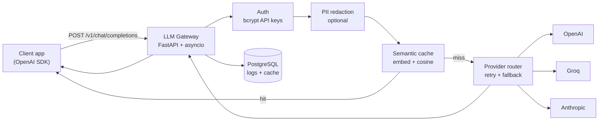

# LLM Gateway

**OpenAI-compatible middleware** for production LLM apps — one API in front of OpenAI, Groq, and Anthropic, with streaming, semantic cache, retries, observability, and optional PII redaction.

> Drop-in proxy: clients change only `base_url` and `api_key`. Everything else is gateway policy.

[](https://www.python.org/downloads/)
[](https://fastapi.tiangolo.com/)
[](#run-tests)

---

## Why this exists

Calling an LLM API directly works until you need **auth**, **streaming that cancels on disconnect**, **cache hits on similar prompts**, **p95 latency you can defend in an interview**, and **PII that never reaches the provider**.

This project is a **portfolio-grade gateway** — not a chat UI — built in phased commits with measured trade-offs documented in [`docs/DESIGN.md`](docs/DESIGN.md).

---

## At a glance

| | |
|---|---|
| **Thin-proxy overhead** | **+88 ms p50** vs direct OpenAI (cache bypass mode) — [`docs/BENCHMARK.md`](docs/BENCHMARK.md) |
| **Semantic cache** | Cosine similarity ≥ 0.92, persisted to PostgreSQL |
| **Providers** | OpenAI · Groq · Anthropic with retries + cross-provider fallback |
| **PII (optional)** | Email/phone tokenization — Latin, Arabic, Hebrew |
| **Test coverage** | 81 automated tests (unit + HTTP + PostgreSQL integration) |

---

## How it works



**Streaming path:** SSE chunks forwarded immediately; upstream cancelled when the client disconnects — no full-response buffering.

**Cache path:** Non-streaming prompts embed once; similar prompts skip the provider. Threshold tuning and false-hit analysis in [`docs/CACHE_TUNING.md`](docs/CACHE_TUNING.md).

---

## What you get

### Core proxy
- OpenAI-compatible `POST /v1/chat/completions` (JSON + SSE)
- Model-based routing: GPT → OpenAI, Llama/Mixtral → Groq, Claude → Anthropic
- Transient error retries and optional fallback model swap

### Production concerns
- **Observability** — per-request latency, tokens, cost; p50/p95/p99 metrics API + dashboard
- **Security** — bcrypt-hashed API keys with indexed lookup prefix ([`docs/SECURITY.md`](docs/SECURITY.md))
- **PII** — redact before provider and cache; optional detokenize on response ([`docs/PII.md`](docs/PII.md))

### Evidence, not hand-waving
- Benchmark scripts with before/after numbers in `docs/benchmark_*.json`
- Design doc with rejected alternatives and honest limitations
- Integration tests for auth, streaming concurrency, cache hits, provider resilience

---

## Quick start

**Prerequisites:** Python 3.11+, Docker (PostgreSQL), OpenAI API key

```powershell
git clone https://github.com/AseelHerzallah1/llm-gateway.git
cd llm-gateway

python -m venv .venv
.venv\Scripts\Activate.ps1          # Windows
# source .venv/bin/activate         # macOS/Linux

pip install -r requirements.txt
pip install -e ".[dev]"

copy .env.example .env              # set OPENAI_API_KEY, DATABASE_URL

docker compose up db -d
alembic upgrade head
python scripts/seed_test_project.py # save the gw-sk-... key

uvicorn app.main:app --host 127.0.0.1 --port 8001
```

### Try it in one minute

**Terminal 1** — keep the server running:

```powershell
uvicorn app.main:app --host 127.0.0.1 --port 8001
```

**Terminal 2** — five-step live demo (health → chat → stream → cache → metrics):

```powershell
python scripts/demo.py gw-sk-your-key
```

Optional PII demo (set `PII_REDACTION_ENABLED=true` in `.env`, restart server):

```powershell
python scripts/test_pii_redaction.py gw-sk-your-key
```

Full manual matrix: [`docs/TESTING.md`](docs/TESTING.md)

### Run tests

```powershell
pytest                  # full suite (81 tests)
pytest -m db -v         # PostgreSQL integration only
```

---

## Documentation

| Doc | Read this for… |
|-----|----------------|
| [`docs/DESIGN.md`](docs/DESIGN.md) | **Why** — streaming, cache, fallback trade-offs |
| [`docs/ARCHITECTURE.md`](docs/ARCHITECTURE.md) | Component map and data flow |
| [`docs/API.md`](docs/API.md) | Endpoints, schemas, error codes |
| [`docs/BENCHMARK.md`](docs/BENCHMARK.md) | Measured gateway latency overhead |
| [`docs/CACHE_TUNING.md`](docs/CACHE_TUNING.md) | Similarity threshold experiments |
| [`docs/SECURITY.md`](docs/SECURITY.md) | API key hashing audit |
| [`docs/PII.md`](docs/PII.md) | PII redaction pipeline |
| [`docs/TESTING.md`](docs/TESTING.md) | Manual + automated test guide |

---

## Project layout

```
app/
  auth/           API keys (bcrypt)
  cache/          Semantic cache + PostgreSQL persistence
  providers/      OpenAI, Groq, Anthropic — router, retry, fallback
  observability/  Request logs, percentiles, cost
  security/       PII detection and redaction
  routes/         chat, metrics, dashboard, health
tests/            unit + integration (pytest -m db)
scripts/          demo.py, benchmarks, E2E helpers
docs/             design decisions and measured results
```

---

## Local endpoints

| URL | Description |
|-----|-------------|
| http://127.0.0.1:8001/health | Liveness |
| http://127.0.0.1:8001/v1/chat/completions | Chat proxy |
| http://127.0.0.1:8001/v1/metrics | Latency percentiles + cost |
| http://127.0.0.1:8001/dashboard | Minimal metrics UI |

---

## Stack

Python 3.11 · FastAPI · httpx · asyncio · PostgreSQL · SQLAlchemy async · Alembic · pytest

---

Built by [AseelHerzallah1](https://github.com/AseelHerzallah1) — feedback and issues welcome.
