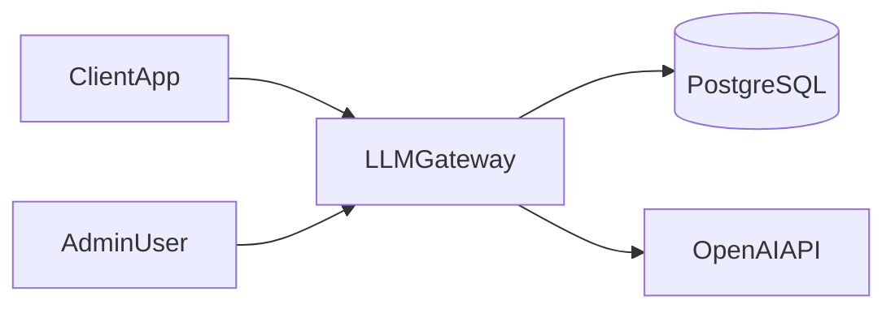
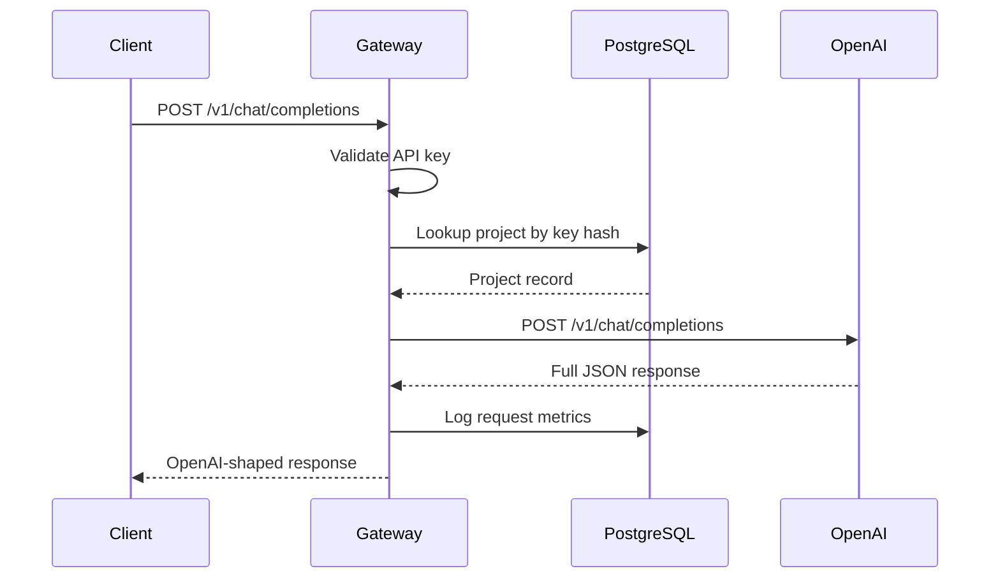
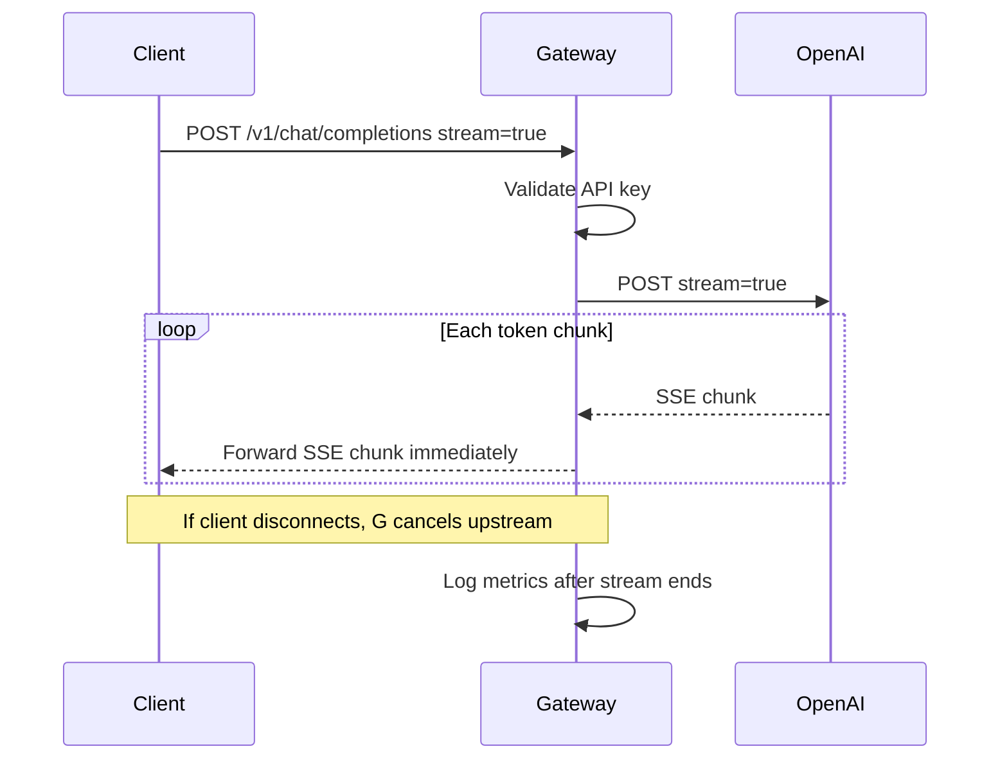
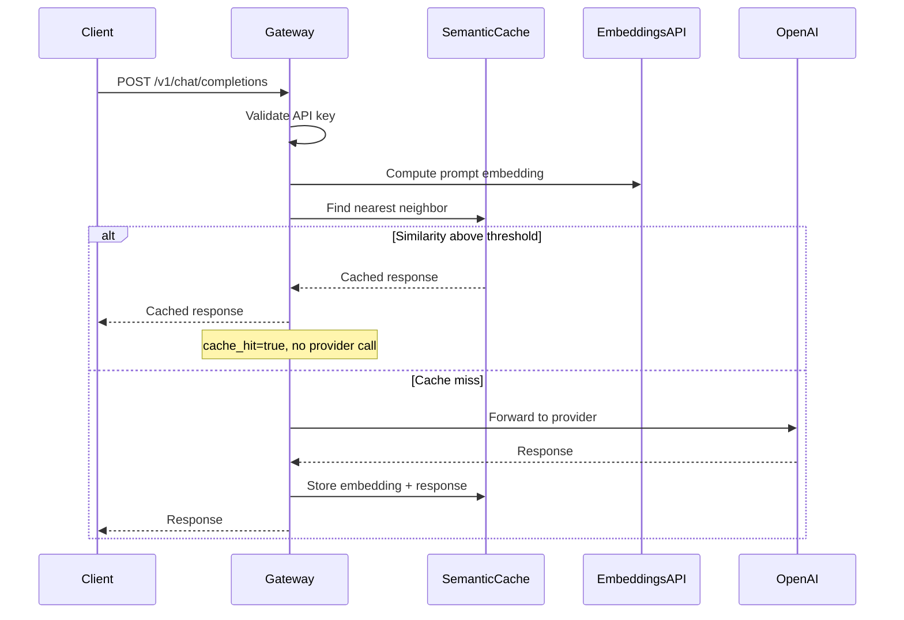
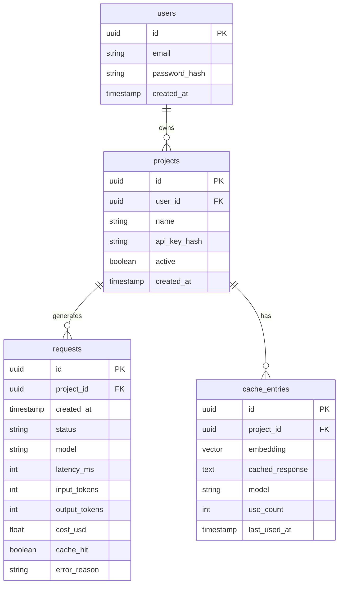

# Architecture — LLM Gateway v1

## System context

The gateway is the only component clients talk to. It owns auth, logging, caching, and proxy logic. PostgreSQL stores projects, request logs, and cache entries. OpenAI is the sole LLM provider in v1.

---

## Request flow — non-streaming (Phase 3)

---

## Request flow — streaming (Phase 4)

**Key constraint:** Gateway forwards chunks as they arrive. It does **not** accumulate the full response in memory before sending.

---

## Request flow — with semantic cache (Phase 6)

---

## Component map (by phase)

| Component | Directory (planned) | Phase |
|-----------|---------------------|-------|
| FastAPI app | `app/main.py` | 2 |
| Config | `app/config.py` | 2 |
| Database | `app/db/` | 2 |
| Auth middleware | `app/auth/` | 3 |
| Provider interface | `app/providers/base.py` | 3 |
| OpenAI provider | `app/providers/openai.py` | 3–4 |
| Chat route | `app/routes/chat.py` | 3–4 |
| Observability | `app/observability/` | 5 |
| Metrics route | `app/routes/metrics.py` | 5 |
| Semantic cache | `app/cache/` | 6 |
| Embeddings | `app/embeddings/` | 6 |

---

## Database tables (v1)

`cache_entries` added in Phase 6. `users` and `projects` in Phase 2. `requests` in Phase 5.

---

## Key design decisions

| Decision | Choice | Trade-off |
|----------|--------|-----------|
| OpenAI-compatible API | Yes | Easy client adoption; locked to their schema |
| Non-streaming before streaming | Yes | Slower progress, but isolates proxy bugs |
| Observability before cache | Yes | Can measure cache impact when it ships |
| In-memory cache first | Yes | Simple; lost on restart — acceptable for v1 |
| Single provider v1 | Yes | Less routing complexity; prove proxy first |
| Percentiles over averages | Yes | Harder to compute; much more meaningful |

---

## What is intentionally not in v1 architecture

- Load balancer / multiple gateway instances
- Redis or message queue
- Kubernetes
- LangChain orchestration layer
- PII detection pipeline (Phase 9)
