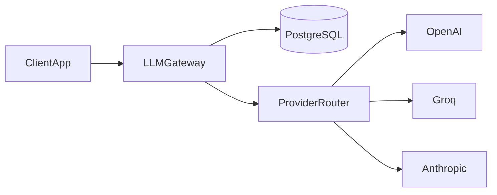
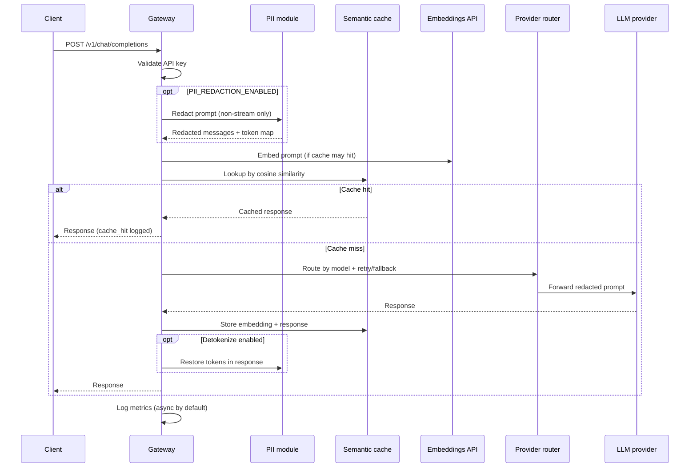
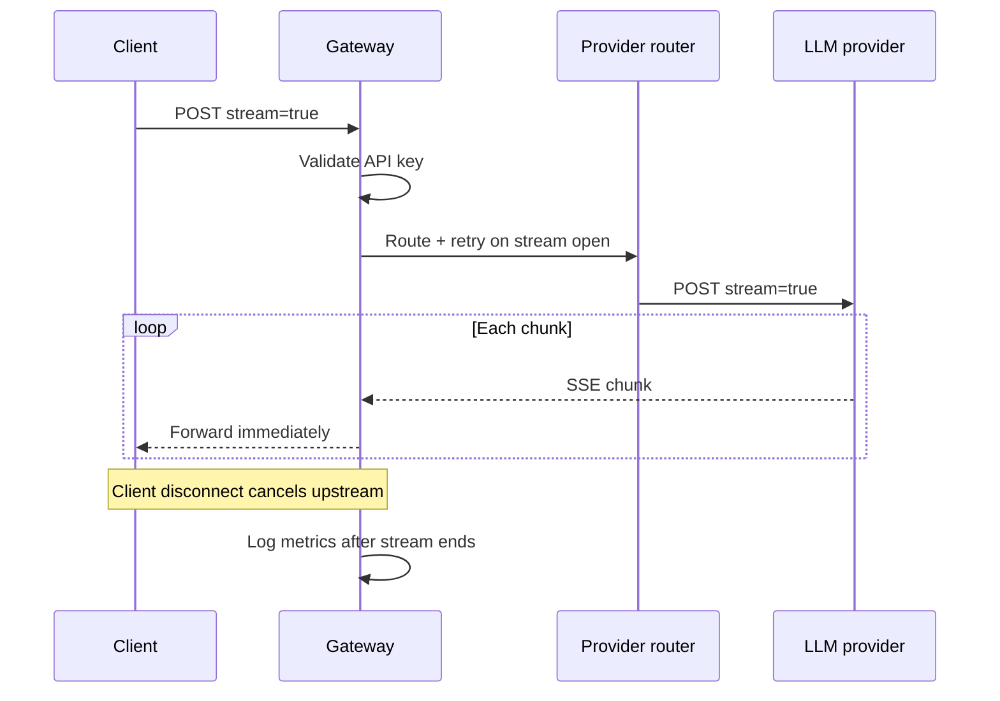
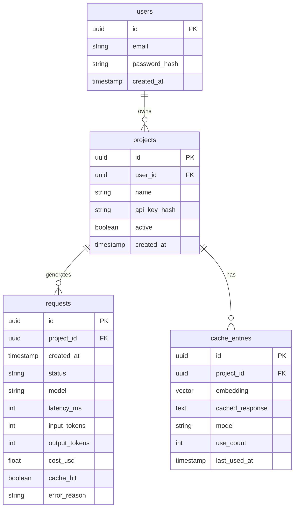

# Architecture — LLM Gateway

## System context

The gateway is the only component clients talk to. It owns auth, optional PII redaction, semantic cache, observability, and provider routing. PostgreSQL stores projects, request logs, and cache entries. The **provider router** selects OpenAI, Groq, or Anthropic by model name, with retries and cross-provider fallback.

---

## Request flow — non-streaming (with cache + optional PII)

**Streaming:** Same auth and routing, but **no PII redaction** and **no semantic cache** on the hot path — SSE chunks forward immediately; upstream cancels on client disconnect.

---

## Request flow — streaming

---

## Component map

| Component | Directory | Role |
|-----------|-----------|------|
| FastAPI app | `app/main.py` | App factory, lifespan, cache hydration |
| Config | `app/config.py` | Env-driven settings (providers, cache, PII) |
| Database | `app/db/` | SQLAlchemy models + async sessions |
| Auth | `app/auth/` | bcrypt API keys, lookup prefix |
| PII redaction | `app/security/pii.py` | Regex detect/redact; optional detokenize |
| Chat route | `app/routes/chat.py` | JSON + SSE completions |
| Semantic cache | `app/cache/` | In-memory index + PostgreSQL persistence |
| Embeddings | `app/embeddings/` | OpenAI embeddings for cache |
| Provider interface | `app/providers/base.py` | Shared `LLMProvider` contract |
| OpenAI / Groq / Anthropic | `app/providers/*.py` | Provider adapters |
| Router + retry + fallback | `app/providers/router.py`, `retry.py`, `fallback.py` | Model routing, resilience |
| Observability | `app/observability/` | Request logs, percentiles, cost |
| Metrics / dashboard | `app/routes/metrics.py`, `app/static/dashboard.html` | `/v1/metrics`, minimal UI |

---

## Database tables

`requests` stores **metadata only** — not prompt or response bodies. When PII redaction is enabled on non-streaming requests, embeddings are built from **redacted** prompt text.

---

## Key design decisions

| Decision | Choice | Trade-off |
|----------|--------|-----------|
| OpenAI-compatible API | Yes | Easy client adoption; locked to their schema |
| Multi-provider router | OpenAI + Groq + Anthropic | More moving parts; better availability story |
| Retries + cross-provider fallback | Yes | Model id may change on fallback |
| Non-streaming before streaming | Yes | Isolates proxy bugs incrementally |
| Observability before cache | Yes | Measure cache impact when it ships |
| In-memory cache + PG persistence | Yes | Fast lookup; not shared across replicas |
| Optional PII redaction (Phase 9) | Regex, non-streaming | Not DLP/NER; streaming bypasses redaction |
| Percentiles over averages | Yes | More meaningful tail latency |

---

## What is intentionally not in architecture (yet)

- Load balancer / multiple gateway replicas with shared cache index
- Redis or message queue
- Kubernetes deployment manifests
- LangChain orchestration in the core
- NER/ML-based PII or prompt-injection classifiers
- pgvector / FAISS (in-memory cache first — see [`CACHE_TUNING.md`](CACHE_TUNING.md))
