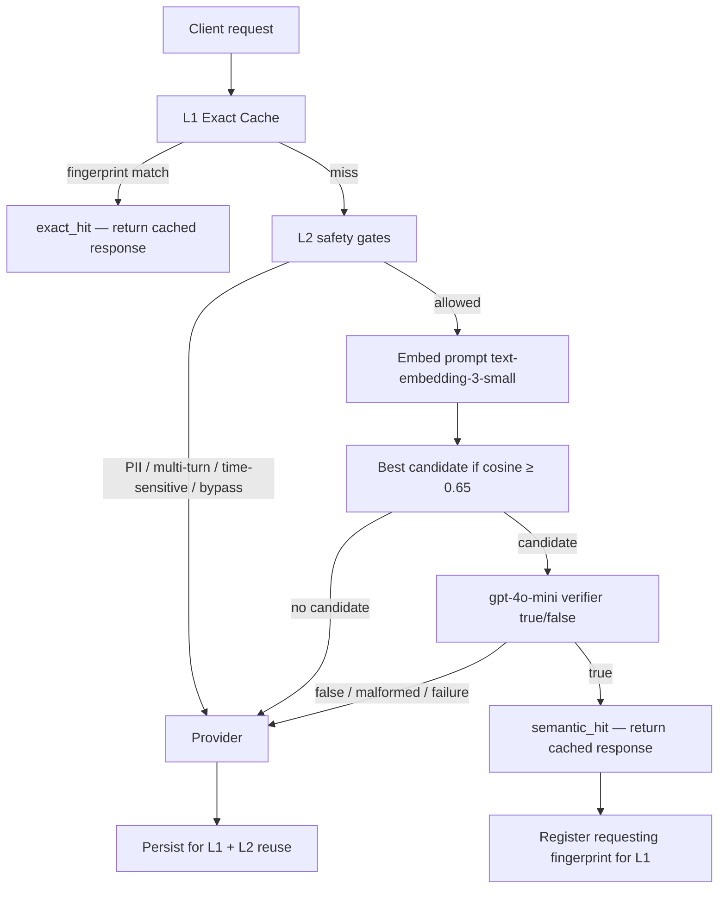

# Semantic cache — v0.2 L1 exact + L2 verified semantic

Production cache in v0.2 uses **two layers**:

1. **L1 Exact Cache** — deterministic SHA-256 fingerprint lookup (O(1) in memory).
2. **L2 Verified Semantic Cache** — embedding candidate retrieval at **0.65**, then **gpt-4o-mini answer-equivalence verification** (`true` / `false` only).

Cosine similarity is a **retrieval signal only**. It is **not** the final reuse decision.

---

## Architecture (non-streaming)



---

## Terminology

| Term | Meaning |
|------|---------|
| **Exact Cache (L1)** | Deterministic response reuse for identical request identity (model, messages, temperature, max_tokens, fingerprint schema, PII value hash). |
| **Verified Semantic Cache (L2)** | Embedding candidate retrieval followed by response-aware answer-equivalence verification. |
| **Candidate threshold 0.65** | Retrieval threshold only — **not** a safety threshold. |
| **semantic_skipped** | L2 bypassed (e.g. detected PII) while L1 may still exact-hit. |

---

## Configuration

| Variable | Default | Role |
|----------|---------|------|
| `SEMANTIC_CACHE_ENABLED` | `true` | Master switch |
| `CACHE_CANDIDATE_THRESHOLD` | `0.65` | L2 retrieval minimum cosine similarity |
| `CACHE_VERIFIER_MODEL` | `gpt-4o-mini` | Answer-equivalence verifier |
| `CACHE_VERIFIER_TIMEOUT_S` | `10` | Verifier HTTP timeout |
| `CACHE_VERIFIER_MAX_TOKENS` | `4` | Verifier output cap |
| `CACHE_SIMILARITY_THRESHOLD` | `0.92` | **Deprecated** — v0.1 cosine-only gate; retained for config compat only |

---

## PII behavior (v0.2)

- **L1:** Fingerprint includes a hash of redaction token **values** so `alice@…` and `bob@…` do not share an exact identity after redaction to the same placeholder.
- **L2:** If PII redaction detected tokenized PII in the current request → **skip semantic reuse entirely** (`semantic_skipped` → provider). PII-free requests may use L2 normally.
- Response **detokenization** behavior is unchanged.

---

## Fail-open

Any failure in exact DB lookup, embedding, semantic scan, verifier API, verifier timeout, or malformed verifier output → **fall through to provider**. Cached content is returned only on **exact fingerprint match** or verifier **`true`**.

---

## Historical v0.1 cosine-only tuning

v0.1 used cosine similarity ≥ **0.92** as the production reuse decision. Measured similarities and trade-offs from that era remain in [`docs/eval/`](eval/) research artifacts — they informed the v0.2 redesign but are **not** current production behavior.

**Re-run legacy similarity experiments (read-only research):**

```powershell
python scripts/evaluate_cache_threshold.py
```

---

## Observability

| Signal | Source |
|--------|--------|
| `cache_hit_rate` | PostgreSQL `requests.cache_hit` (exact + semantic) |
| Prometheus `cache_result` | `exact_hit`, `semantic_hit`, `miss`, `bypass`, `none` |
| Prometheus cache operations | `exact_hit`, `semantic_hit`, `semantic_reject`, `semantic_miss`, `semantic_skipped`, `store`, `lookup_skipped` |
| `cache_entries.exact_use_count` / `semantic_use_count` | Per-layer reuse counters |

---

## Research validation (local checkpoint)

Verified semantic caching was validated in commit `5d5935c` (`research: validate and optimize verified semantic caching`):

- Candidate threshold **0.65** + gpt-4o-mini boolean verifier
- **13/14** Class-A recall, **0** false positives on hard negatives in experiment harness
- Verifier p50 ~**482 ms**; verified hit p50 ~**696 ms** (local experiment)

See `docs/eval/verifier_optimization_experiment.json` for full artifacts.

### v0.2 production benchmark (2026-08-27)

Final seven-path controlled run: `docs/benchmark_v2_final_validation.json` (`scripts/benchmark_cache_v2.py --final`).

| Result | p50 |
|--------|-----|
| L1 exact miss | 1685 ms |
| L1 exact hit | 225 ms (~7.5× faster vs miss) |
| L2 short semantic hit | 1577 ms (vs bypass 971 ms — overhead can dominate short gens) |
| L2 long semantic hit | 1195 ms (vs provider baseline 2450 ms — ~51.2% reduction) |
| Dangerous-negative safety (Path F) | 30/30 rejected, 0 unsafe semantic hits |

Long provider baseline artifact: `docs/benchmark_v2_long_provider_validation.json`.

**L1 alias after L2 hit:** On verified semantic reuse, the gateway upserts the requesting fingerprint into the L1 exact index so identical repeats skip embed + verifier. See `app/cache/chat_integration.py` (`_register_exact_fingerprint_alias`).

Diagnostic pre-fix benchmark preserved in `docs/benchmark_v2_validation.json` — do not cite as final.

---

## Related tests

| Test module | Purpose |
|-------------|---------|
| `tests/integration/test_cache_db.py` | L1/L2 E2E with PostgreSQL |
| `tests/integration/test_cache_semantic.py` | Class-A verified semantic hits |
| `tests/integration/test_cache_failopen.py` | Fail-open + dangerous negatives |
| `tests/unit/test_cache_fingerprint.py` | Fingerprint identity rules |
| `scripts/smoke_cache_v02.py` | Focused smoke (exact / semantic / reject) |
