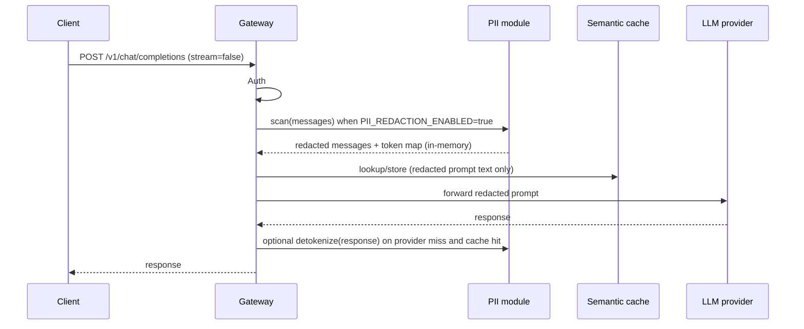

# PII Redaction — Phase 9

Optional regex-based redaction for **non-streaming** chat prompts before they reach third-party LLM providers or the semantic cache. Responses can optionally be detokenized for the client.

This is **not** a DLP or compliance suite. It does not detect names, addresses, SSNs, passports, or generic bank account numbers.

---

## Supported types

| Type | Token | Detection | Default |
|------|-------|-----------|---------|
| Email | `[EMAIL_N]` | RFC5322-simplified regex | On when PII enabled |
| Phone | `[PHONE_N]` | E.164 / US / Israeli formats; Arabic-Indic digit normalization | On when PII enabled |
| Credit card | `[CREDIT_CARD_N]` | Digit groups + **Luhn** validation | **Off** (opt-in) |
| IBAN | `[IBAN_N]` | ISO 13616 pattern + **MOD-97-10** validation | **Off** (opt-in) |

**Overlap priority:** EMAIL > CREDIT_CARD > IBAN > PHONE

---

## Unsupported (future work)

| Type | Reason |
|------|--------|
| Names | Requires NER/ML |
| Addresses | Unstructured; no reliable regex |
| US SSN | No public checksum; high false positives |
| Passport numbers | No universal format or checksum |
| Generic bank account numbers | Prefer IBAN only (structured + checksum) |
| Israeli Teudat Zehut | Checksum exists; deferred |
| Streaming redaction | Chunk boundary complexity |
| ML / NER classifier | Explicit non-goal for Phase 9 |

---

## Pipeline



**Order matters:** redact **before** cache embed/store so raw prompt PII does not enter embeddings.

**Streaming:** `stream=true` bypasses redaction entirely (deferred).

---

## Arabic / Hebrew

Unicode-aware for **email and phone only**:

- Emails in RTL sentences (Latin `@` pattern on original text)
- Israeli phones in Hebrew text
- Arabic-Indic digits normalized to ASCII before phone matching

No Arabic/Hebrew keyword context patterns. No RTL name or address detection.

---

## Token format

```
[EMAIL_1]  [PHONE_1]  [CREDIT_CARD_1]  [IBAN_1]
```

- Stable within a **single request** (same value twice → same token)
- Counter per type per request
- Map discarded after response — not persisted

---

## Configuration

| Env var | Default | Purpose |
|---------|---------|---------|
| `PII_REDACTION_ENABLED` | `false` | Master switch |
| `PII_REDACT_EMAIL` | `true` | Redact emails |
| `PII_REDACT_PHONE` | `true` | Redact phone numbers |
| `PII_REDACT_CREDIT_CARD` | `false` | Opt-in; Luhn-validated cards only |
| `PII_REDACT_IBAN` | `false` | Opt-in; MOD-97-validated IBANs only |
| `PII_DETOKENIZE_RESPONSES` | `true` | Restore tokens in client response |

Restart uvicorn after changing `.env`.

---

## What is stored

| Store | Raw prompt PII? |
|-------|-----------------|
| `requests` table | No message bodies (metadata only) |
| `cache_entries.embedding` | Built from redacted prompt when PII on |
| `cache_entries.cached_response` | Provider reply (may echo tokens) |
| Token map | In-memory per request only |
| Dashboard / app logs | No prompt content |

---

## Tests

```powershell
pytest tests/unit/test_pii.py -v
pytest tests/integration/test_chat.py -k pii -v
```

Unit tests cover email, phone, credit card (Luhn), IBAN (MOD-97), Arabic/Hebrew contexts, and detokenization.

Integration tests verify provider and cache/store receive redacted prompts when enabled, cache-hit detokenization, and streaming bypass behavior.

---

## Detokenization

When `PII_DETOKENIZE_RESPONSES=true` (default), tokens in provider or **cached** responses are restored for the client using the in-memory map from that request.

- **Provider miss:** provider may return `[EMAIL_1]`; client receives the original email.
- **Cache hit:** cached response may contain `[EMAIL_1]`; client receives the original email after detokenize.
- **`PII_DETOKENIZE_RESPONSES=false`:** client receives tokens unchanged.

---

## Success criteria

- [x] Email and phone redacted on non-streaming path when enabled
- [x] Credit card and IBAN redacted when opt-in flags set
- [x] Arabic/Hebrew email and phone cases covered
- [x] Provider receives tokens, not raw values (integration tests)
- [x] Cache lookup/store receives redacted prompt text (integration test)
- [x] Detokenize restores values on provider miss and cache hit when enabled
- [x] With `PII_DETOKENIZE_RESPONSES=false`, client sees tokens
- [x] With `PII_REDACTION_ENABLED=false`, text unchanged
- [x] Streaming bypasses redaction (documented integration test)
