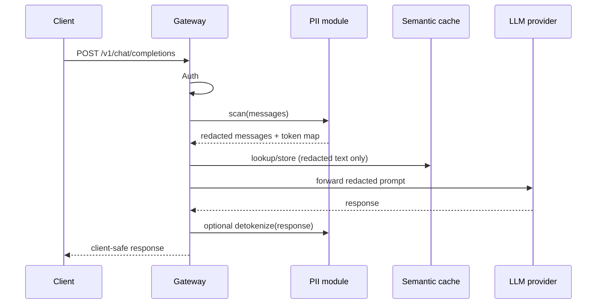

# PII Protection — Phase 9 (v2)

Redact personally identifiable information (PII) from prompts **before** they leave the gateway to third-party LLM providers, and optionally restore tokens in responses for the client.

---

## Problem

Clients may send emails, phone numbers, national IDs, or names in chat messages. Without a gateway layer:

- PII is stored in provider logs (OpenAI, Groq, etc.)
- PII may appear in our `requests` table and semantic cache
- Compliance risk (GDPR-style data minimization)

The gateway is the **right place** to intercept: one choke point before any provider or cache.

---

## Goals (Phase 9)

| Goal | Priority |
|------|----------|
| Detect common PII in **English (Latin script)** | Must have |
| Replace with stable placeholders (`[EMAIL_1]`, `[PHONE_1]`) | Must have |
| Per-request token map (in-memory, not persisted by default) | Must have |
| Wire into non-streaming chat path behind a config flag | Must have |
| **Arabic / Hebrew script** patterns (emails, phones, IDs in RTL text) | Should have |
| Unit tests with realistic examples | Must have |
| Detokenize provider **responses** before returning to client | Nice to have (9.x) |
| Streaming PII redaction | Deferred (chunk boundaries are hard) |
| ML-based NER classifier | Deferred (regex + script-aware rules first) |

---

## Non-goals (stay out of Phase 9)

| Item | Reason |
|------|--------|
| Regex-only “prompt injection detection” | Easily bypassed; not real security |
| Persisting token maps in PostgreSQL | Scope creep; session-only unless required |
| pgvector / FAISS upgrade | Separate track (cache scale), not PII |
| Redacting request logs after the fact | Prevent at ingress instead |

---

## Pipeline (target architecture)



**Order matters:** redact **before** cache embed/store so raw PII never enters `cache_entries` or embeddings.

---

## Detection strategy

### Phase 9.1 — Latin patterns (Task 9.2 implementation)

| Type | Approach |
|------|----------|
| Email | RFC5322-simplified regex |
| Phone | E.164-ish / common US/international formats |
| Credit card | Luhn + 13–19 digit groups (optional, high false-positive risk — config off by default) |

### Phase 9.2 — Arabic / Hebrew (Task 9.3)

| Type | Approach |
|------|----------|
| Arabic / Hebrew digits | Normalize `٠-٩` / `0-9` before phone matching |
| RTL emails | Same email regex on Unicode text |
| Arabic labels | Context patterns (e.g. `البريد`, `جوال`, `טלפון`) — assist boundaries only |

**Why not English-only:** Portfolio differentiator for MENA markets; proves Unicode-aware parsing, not just `re.search` on ASCII.

---

## Token format

```
[EMAIL_1]  [PHONE_1]  [ID_1]
```

- Stable within a **single request** (same email twice → same token)
- Counter per type per request
- Map discarded after response (default) — no PII at rest in map

---

## Configuration (planned)

| Env var | Default | Purpose |
|---------|---------|---------|
| `PII_REDACTION_ENABLED` | `false` | Master switch |
| `PII_REDACT_EMAIL` | `true` | Redact emails |
| `PII_REDACT_PHONE` | `true` | Redact phone numbers |
| `PII_REDACT_CREDIT_CARD` | `false` | Off by default (false positives) |

---

## Phase 9 task map

| Task | Deliverable |
|------|-------------|
| **9.1** | This document + DEVELOPMENT_LOG entry |
| **9.2** | `app/security/pii.py` — Latin detect + redact + unit tests |
| **9.3** | Arabic/Hebrew patterns + tests |
| **9.4** | Wire into `chat.py` (non-streaming first) |
| **9.5** | Manual test script + `docs/TESTING.md` section |
| **9.6** | Optional: detokenize responses |

---

## Success criteria

- [ ] Prompt `Contact me at aseel@example.com` → provider receives `Contact me at [EMAIL_1]`
- [ ] Same email twice in one request → same token
- [ ] Arabic prompt with embedded email/phone → redacted
- [ ] With `PII_REDACTION_ENABLED=false`, text unchanged
- [ ] Unit tests cover Latin + at least one Arabic/Hebrew case
- [ ] No raw PII in semantic cache when redaction enabled

---

## Meeting-ready summary

> Phase 9 adds a **PII redaction pipeline** at the gateway choke point — tokenize sensitive fields before provider and cache, with Unicode-aware rules for Arabic and Hebrew, because regex-only English filters miss real MENA user data and don’t belong in a serious compliance story.
